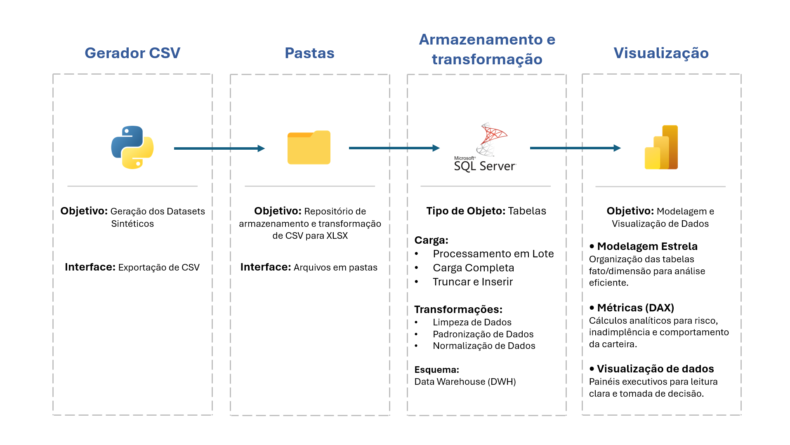
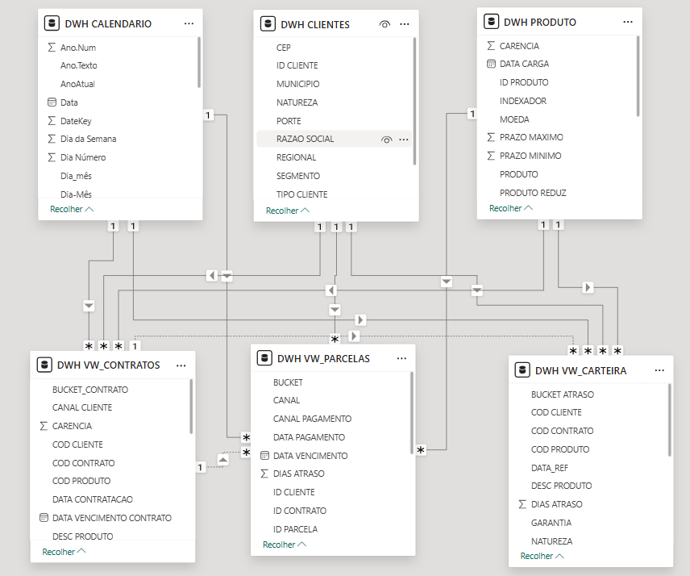
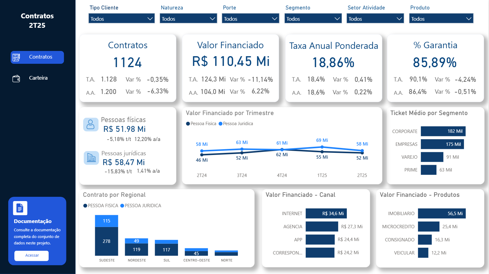
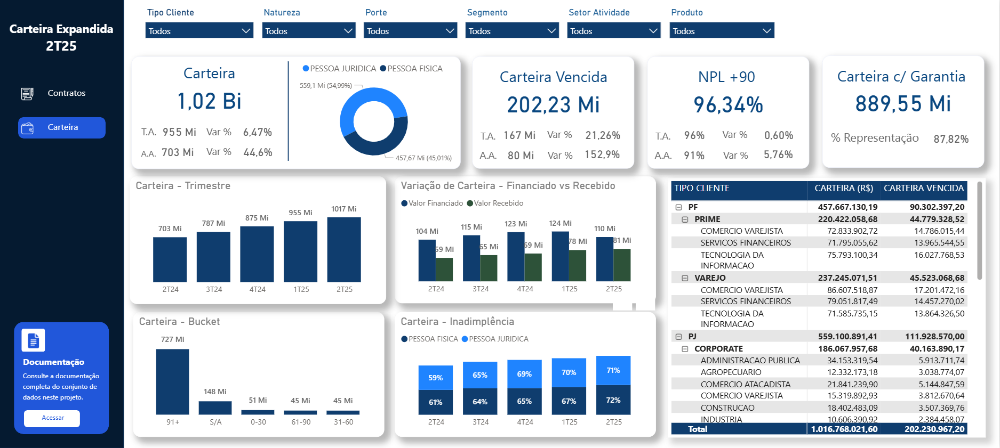

<h2>Crédito e Risco</h2>

Projeto de portfólio que replica um ambiente real de análise de crédito bancário, incluindo modelagem SQL, construção de tabelas fato/dimensão, cálculos de risco e visualizações avançadas no Power BI.

<em>Nota: todos os dados utilizados neste projeto são sintéticos e criados apenas para fins educacionais.</em>

<h3> Acesse o Dashboard Publicado</h3>

    <a href="https://app.powerbi.com/view?r=eyJrIjoiYzgxMjdhNzctMjRiNy00NGZkLWExZDktZjAyNDBjNTQzYmU2IiwidCI6ImVkYjcyZWY5LWI3ZGYtNGU4MS1hMDBhLWE2OWFlOGY5MDE3ZSJ9" target="_blank">
        Credito & Risco
    </a>

<h3>Objetivo</h3>
O objetivo deste projeto é desenvolver um ambiente analítico completo para crédito e risco, estruturando desde a modelagem de dados em SQL Server até a criação de métricas financeiras e visualizações no Power BI. A solução consolida informações de contratos, clientes e parcelas em um modelo dimensional otimizado, permitindo análises confiáveis sobre inadimplência, exposição ao risco, aging e comportamento da carteira.

<h3>Tecnologias</h3>

<ul>
    <li><strong>SQL Server</strong>: Armazenamento das bases sintéticas, tratamento e padronização dos dados, modelagem dimensional e criação de views analíticas.</li> 
    <li><strong>Power BI Desktop</strong>: Modelagem do dataset, criação de métricas em DAX, transformações no Power Query e construção das visualizações.</li>
    <li><strong>Excel</strong>: Suporte na análise preliminar, validação de dados e documentação auxiliar.</li>
    <li><strong>Power BI Service</strong>: Publicação dos relatórios e gerenciamento dos workspaces.</li>
</ul>

<h3>Referências</h3>

- [Credrisk – Indicadores Financeiros na Avaliação de Crédito](https://credrisk.com.br/2025/11/04/principais-indicadores-financeiros-credito-risco-clientes/)
- [FasterCapital – Indicadores de Risco de Crédito](https://fastercapital.com/pt/contente/Indicadores-de-risco-de-credito--como-definir-e-usar-indicadores-de-risco-de-credito-para-monitoramento-de-risco-de-credito.html)
- [BT Créditos – Avaliação de Risco de Crédito](https://btcreditos.com.br/blog/avaliacao-risco-de-credito/)
- [RISCO DE CRÉDITO: Aprenda como Analisar e Classificar (YouTube)](https://www.youtube.com/watch?v=Lxm93QQroBs)
- [Análise de Risco e Crédito Aula 01 – IFRO (YouTube)](https://www.youtube.com/watch?v=aCVKlteYPcA)
- [Aula inaugural: Curso Análise de Risco de Crédito (YouTube)](https://www.youtube.com/watch?v=6setNmIO01c)
- [O que são Indicadores de Risco? | ME Explica (YouTube)](https://www.youtube.com/watch?v=6nm-6kwpT8g)
- [Descubra o Melhor Indicador de Crédito (YouTube)](https://www.youtube.com/watch?v=82VuPaiSDM4)

<h3>Escopo</h3>
O escopo contempla a implementação de todo o fluxo analítico de crédito e risco, incluindo: 

 
<ul>
<li><strong>Modelagem relacional e dimensional</strong> 
Estruturação de tabelas base, staging e camadas analíticas com fatos e dimensões.</li>

<li> <strong>Desenvolvimento SQL</strong> 
Criação de views, CTEs, rotinas de cálculo e integrações necessárias para consolidar contratos, parcelas, clientes e garantias.</li>

<li> <strong>Construção dos principais KPIs de risco</strong> 
EAD, saldo vencido, bucket de atraso, inadimplência, aging, fluxo de pagamentos e performance por cliente.</li>

<li><strong>Ambiente de visualização</strong> 
Desenvolvimentos de painéis em Power BI com visões de carteira, risco, comportamento e tendência.</li>

<li><strong>Pipelines manuais (simulação)</strong> 
Organização e versionamento de toda a lógica de extração, transformação e apresentação para fins educacionais/portfólio.</li>
</ul>

<h3>Arquitetura do Projeto</h3>

A arquitetura do projeto segue um fluxo analítico estruturado em camadas dentro do SQL Server, começando pela ingestão e padronização dos dados brutos, avançando para a modelagem dimensional e finalizando na camada de consumo no Power BI. O processo inclui organização das tabelas base, criação de views intermediárias, aplicação de regras de negócio, consolidação de contratos e parcelas e preparação de tabelas fato e dimensões otimizadas para análise. Essa arquitetura garante rastreabilidade, consistência e performance no cálculo dos indicadores de crédito e risco.

<h3>Modelagem Dimensional</h3>

A modelagem dimensional do projeto foi estruturada para refletir o funcionamento real de uma operação de crédito e risco, organizando os dados em tabelas fato e dimensão com granularidade consistente e foco em análises financeiras. A construção da base contou com geração assistida por IA, porém todo o modelo, lógica de negócio e estrutura final foram totalmente orientados, validados e revisados manualmente para garantir coerência técnica e aderência aos requisitos do domínio bancário.

A solução é composta por duas tabelas fato principais — Fato_Contrato e Fato_Parcela — que representam, respectivamente, os contratos ativos e históricos de crédito, bem como o comportamento de pagamento associado. Complementam o modelo dimensões essenciais como Dim_Cliente, Dim_Empresa, Dim_Produto e Dim_Calendario, que fornecem contexto para filtragem, segmentação, análises de inadimplência, aging, buckets de atraso e composição da carteira.

Essa modelagem permite cálculos precisos de indicadores críticos (como EAD, saldo vencido, percentuais de risco e distribuição por bucket), garantindo que o Power BI opere sobre uma estrutura otimizada, confiável e alinhada às práticas de Data Warehousing utilizadas em instituições financeiras.

<h3>KPIs e Indicadores Implementados</h3>

O projeto contempla um conjunto de indicadores utilizados em análises de crédito e risco, permitindo monitorar evolução da carteira, comportamento de pagamento e níveis de inadimplência. Entre os principais KPIs desenvolvidos estão:

<ul>

<li>EAD (Exposure at Default) — Representa a exposição total da carteira no momento de um possível default, considerando o saldo dos contratos ativos.</li>

<li>Saldo Vencido — Soma dos valores de parcelas em atraso, classificadas por faixa de dias.</li>

<li>Saldo a Vencer — Valor total das parcelas futuras ainda dentro do prazo.</li>

<li>Bucket de Atraso — Segmentação das parcelas vencidas por faixas (0–30, 31–60, 61–90, 91+ dias).</li>

<li>% de Inadimplência — Proporção da carteira que se encontra vencida acima do limite definido como default.</li>

<li>Aging da Carteira — Distribuição temporal das parcelas entre vencidas, a vencer e em risco.</li>

<li>Fluxo de Pagamentos — Análise temporal da regularidade dos pagamentos e tendência de comportamento.</li>

<li>Distribuição da Carteira por Cliente — Avalia concentração de risco por tomador.</li>

<li>Distribuição da Carteira por Produto — Identifica produtos de crédito com maior exposição e risco.</li>

<li>Performance de Recebimento — Mede a relação entre parcelas previstas e parcelas efetivamente pagas no período.</li>
</ul>

<h3>Desenvolvimento SQL</h3>

O desenvolvimento em SQL Server estruturou as bases analíticas que sustentam todo o projeto. Foram criadas views especializadas para consolidar informações de clientes, produtos, contratos, parcelas e composição da carteira, aplicando regras de negócio para cálculo de saldos, identificação de atraso, classificação de bucket e preparação de indicadores financeiros.

A solução é composta pelas seguintes views principais:

<ul>
<li>DWH.CLIENTES — consolida dados cadastrais e características relevantes para segmentação e análise de risco.</li>

<li>DWH.PRODUTO — estrutura a categorização dos produtos de crédito e suas propriedades financeiras.</li>

<li>DWH.VW_CONTRATOS — unifica contratos ativos e históricos, aplicando regras de granularidade e métricas contratuais.</li>

<li>DWH.VW_PARCELAS — organiza o ciclo das parcelas, incluindo datas, valores, situação, atraso e classificação por faixas.</li>

<li>DWH.VW_CARTEIRA — integra contratos e parcelas para formar uma visão completa da carteira consolidada, utilizada diretamente pelo Power BI.</li>
</ul>

    <a href="scripts" target="_blank">
        Acesse as consultas de desenvolvimento
    </a>

Essas views formam a camada analítica do projeto, garantindo dados preparados, consistentes e prontos para consumo, seguindo boas práticas de modelagem e governança aplicadas em ambientes bancários.

<h3>Desenvolvimento Power BI</h3>

O desenvolvimento no Power BI foi construído inteiramente sobre conexões diretas ao SQL Server, garantindo que todas as tabelas do modelo reflitam exatamente as views da camada DWH. As tabelas DIM.CLIENTES, DIM.PRODUTO, FATO.CONTRATOS, FATO.PARCELAS e FATO.CARTEIRA foram importadas diretamente do banco, mantendo o modelo alinhado à arquitetura SQL e evitando transformações redundantes no Power Query.

A tabela DWH.CARTEIRA atua como fato principal e concentra as métricas de análise. As demais tabelas funcionam como dimensões, estruturando um modelo estrela claro e performático, com relacionamentos bem definidos para suportar análises segmentadas de risco e crédito.

O Power Query foi utilizado apenas para gerenciar as conexões com o SQL Server e para pequenas operações auxiliares, enquanto toda a lógica analítica foi mantida no banco ou em DAX. As medidas foram organizadas na tabela _Medidas, com grupos temáticos como Carteira, Contratos e Geral, seguindo boas práticas de governança métrica.

Foram desenvolvidos KPIs como Valor Financiado, Carteira Vencida, NPL +90, Ticket Médio, Percentual de Garantia, variações t/t e a/a, inadimplência por PF/PJ e ranking da carteira por cliente, permitindo uma análise robusta da operação de crédito.

    <a href="metricas" target="_blank">
        Acesse as métricas de desevolvimento
    </a>

<h3>Visualizações e Análises Disponíveis</h3>

O relatório em Power BI apresenta duas páginas principais — Carteira e Contratos — que organizam todas as análises de crédito e risco desenvolvidas no projeto. Cada página foi estruturada para facilitar a leitura executiva e a navegação entre indicadores operacionais e visões estratégicas da carteira.

<h6>Página: Contratos (2T25)</h6>

Voltada para produção de crédito e perfil de originação:

<ul>
<li>Quantidade de Contratos com variação t/t e a/a. </li>

<li>Valor Financiado e evolução temporal.

<li>Taxa Anual Ponderada (TAP).

<li>Percentual de Garantia aplicado nos contratos.

<li>Segmentação PF x PJ por volume financiado.

<li>Evolução Trimestral do Valor Financiado (linha).

<li>Ticket Médio por Segmento (Corporate, Empresarial, Varejo, Prime).

<li>Distribuição Regional dos contratos (por região do país).

<li>Valor Financiado por Canal (Agência, App, Internet, Correspondente).

<li>Valor Financiado por Produto (Imobiliário, Microcrédito, Consignado, Veicular).
</ul>

<h6>Página: Carteira (2T25)</h6>

Focada na análise de risco e comportamento da carteira:

<ul>

<li>Carteira Total com variação trimestral e anual.

<li>Composição da carteira por PF e PJ.

<li>Carteira Vencida e evolução dos atrasos.

<li>Carteira +90 (NPL +90) — indicador central de inadimplência crítica.

<li>Carteira com Garantia e participação percentual.

<li>Evolução trimestral da carteira.

<li>Valor Financiado x Valor Pago (comparação fluxo previsto vs realizado).

<li>Distribuição da Carteira por Bucket de Atraso.

<li>Taxas de Inadimplência PF/PJ.

<li>Tabela analítica por segmento, tipo de cliente e carteira vencida.
</ul>

<h3>Requisitos / Tecnologias</h3>

<h6>Tecnologias Utilizadas</h6>

<li>SQL Server — base do Data Warehouse, modelagem dimensional, views analíticas e cálculos de risco.

<li>Power BI Desktop — desenvolvimento dos dashboards, modelo semântico e medidas DAX.

<li>Power Query — conexão direta às views do SQL Server.

<li>DAX — criação dos KPIs e cálculos analíticos.

<li>Excel (documentação auxiliar) — apoio na organização de métricas e levantamentos.

<h6>Requisitos para Executar o Projeto</h6>

<ul>
<li>SQL Server instalado (ou acesso a uma instância) para executar as views e carregar os dados.

<li>Power BI Desktop versão atualizada para abrir o arquivo .pbix.

<li>Conexões configuradas para acessar as views:

<ul>
<li>DIM.CLIENTES

<li>DIM.PRODUTO

<li>FATO.CONTRATOS

<li>FATO.PARCELAS

<li>FATO.CARTEIRA.
</ul>

</ul>

<h4>Projeto desenvolvido para fins de estudo e portfólio, demonstrando domínio em modelagem, SQL e análise de crédito.</h4>

